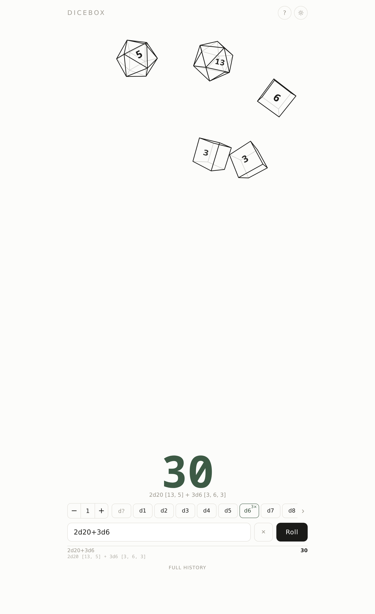
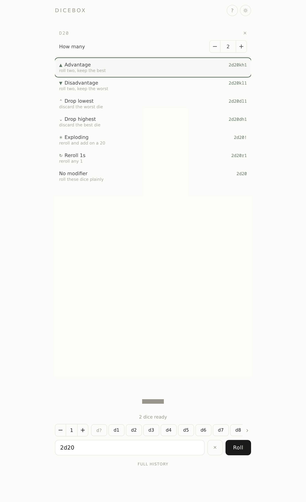
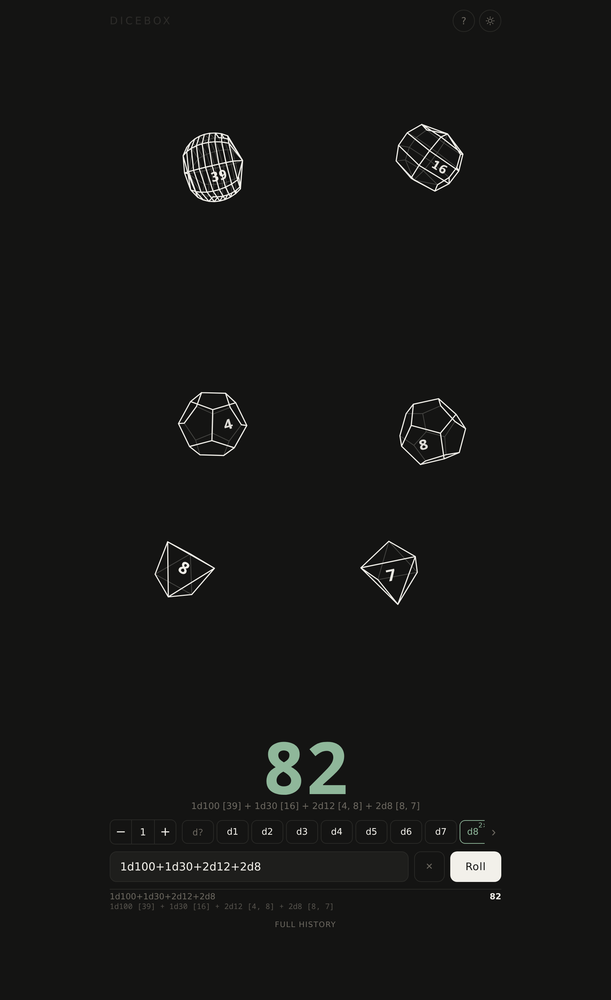

# Dicebox

An offline dice roller for tabletop RPGs. No build step, no dependencies, no
network.

Try it at **[dicebox.trollskull.cc](https://dicebox.trollskull.cc)** — that is a
demo instance, not a service. To keep a copy of your own, see
[Getting it offline](#getting-it-offline): download it as a single file, install
it from the browser, or host it yourself.

<p align="center">
  
  &nbsp;
  
  &nbsp;
  
</p>

<p align="center">
  <em>Tap dice to build a pool · hold one for modifiers · light and dark</em>
</p>

## About

This is a personal project. I kept running into the same problem — there was no
clean, open source, offline-capable web app for rolling dice — so I built one.
If you have had the same problem, you are welcome to it.

It was made with Claude Code. If that is not your bag, that is completely fine:
write your own, fork this, do whatever you want with it. Questions, comments,
issues, pull requests and forks are all welcome.

MIT licensed.

## Using it

Tap dice to build a pool: tap `d20` twice and `d6` once and you have `2d20+1d6`,
staged on the tray and written into the notation field. Press **Roll**, or flick
the tray, to throw them. The pool survives the roll, so re-rolling the same
handful is one more tap.

Typing notation by hand works the same way — the field is the source of truth,
and tapping a die extends whatever is already there.

The number on the left is how many dice each tap adds, so `100` then `d6` gives
you `100d6` without a hundred taps.

**Hold a die** for advantage, disadvantage, drop high/low, exploding and reroll.
Modifiers that answer different questions stack — `4d6dl1!` drops the lowest and
explodes — while two that answer the same one replace each other.

The `d?` button opens a picker for any side count from 1 to 1000, and a die you
choose there gets a button of its own.

## Notation

| Input | Meaning |
| --- | --- |
| `3d6` | three six-sided dice |
| `d20` | one d20 (count defaults to 1) |
| `1d20+5` | with a modifier |
| `2d6+1d8-1` | any number of terms |
| `d%` | percentile, same as `d100` |
| `4d6kh3` | keep highest 3 (ability scores) |
| `2d20kl1` | keep lowest 1 (disadvantage) |
| `4d6dl1` | drop lowest 1 |
| `1d6!` | exploding — reroll and add on a max face |
| `1d10r2` | reroll any result of 2 or lower |

Sides are arbitrary from 1 to 10000, so Mothership's `d100`, DCC's `d14`/`d24`,
and anything else all work. Dropped dice stay visible in parentheses rather than
disappearing.

## How the rolls work

Every die is decided by `crypto.getRandomValues`, the browser's cryptographic
random source. `Math.random()` is not used anywhere in the roll path — it is a
fast pseudo-random generator, seeded per page and predictable given enough
output, which is fine for animation and wrong for the numbers.

Turning random bytes into a die takes some care. Asking for a 32-bit number and
taking `% 20` is the obvious approach and it is subtly unfair: 2³² does not
divide evenly by 20, so the first few faces come up very slightly more often.
Instead a value is drawn and **rejected** if it falls in the remainder at the
top of the range, then drawn again. Every face ends up equally likely, and the
loop almost always finishes on the first try.

### The animation is a picture, not a physics engine

The number is decided the instant you roll — before anything moves. What follows
is a drawing of that outcome, not a simulation that produces it.

The dice do tumble, bounce off the walls of the tray, push each other apart and
settle showing a face, but none of it feeds back into the result. A die that
lands showing 17 was already a 17. This is deliberate: a real physics simulation
would make the outcome depend on frame timing, floating-point rounding and how
hard you flicked, none of which are fair or reproducible. Watching the dice
should be enjoyable; it should not be what decides the roll.

The same goes for the tidying afterwards — dice drift into a sorted grid, group
by type and order high to low. That is presentation.

### Why a d100 does not have exactly 100 faces you can count

Each die is drawn as a real solid whose face count matches its side count, up to
a point. From d3 to d120 that holds for 108 of the 118 possible dice — a d17 has
seventeen faces, a d100 has a hundred.

Past that, the limit is your eyes rather than the maths. At the size a die is
drawn on a phone, facets start landing closer together than a pixel, and the
wireframe stops reading as an object and becomes a grey smudge. Dice above ~120
sides therefore get a representative shape: still a distinct, consistent solid
for that number, but no longer one facet per side. A d1000 drawn honestly would
be a circle.

Shape matters too, not just count. A trapezohedron — the classic d10 form — runs
every facet to one of two points, so its edges converge and it is already
crowded at 24 faces. A banded drum spreads its vertices evenly and stays
countable past 120. That is why dice above 22 sides change family: not for
decoration, but because it is the shape that survives being small.

## The roll log

Every roll is kept for the session, with what each die landed on and when.
**Full history** under the recent rolls opens the lot, and exports it:

- **Copy** puts a readable log on the clipboard
- **CSV** gives one row per die — time, notation, total, sides, value, and
  whether it was kept, exploded or rerolled — which is the shape you want for
  counting faces or checking whether a die is drifting
- **JSON** is the same data with the structure intact

Nothing leaves the browser unless you export it.

## Getting it offline

Three ways, easiest first.

### Download one file

Grab **[dicebox.html](https://dicebox.trollskull.cc/dicebox.html)** — or the copy
in [`dist/`](dist/dicebox.html) — and open it. That is the entire app in a single
file: no server, no install, no network. Put it on a USB stick, email it to
yourself, keep it in a folder with your character sheets. It works the same on a
laptop with the wifi off.

The help panel inside the app links to it too.

### Install it from the web

Open [the demo](https://dicebox.trollskull.cc) and install it. After the first
load it runs offline, because a service worker keeps a local copy.

| Browser | How |
| --- | --- |
| Chrome, Edge (desktop) | Install icon in the address bar, or ⋮ → Cast, save and share → Install page as app |
| Chrome (Android) | The **Install as an app** button in the help panel, or ⋮ → Add to Home screen |
| Safari (iOS/iPadOS) | Share → Add to Home Screen |
| Safari (macOS) | File → Add to Dock |
| Firefox | No install support on desktop. Bookmark it — it still works offline once loaded — or use the single-file build above |

### Run your own copy

There is no build step and no backend, so anything that serves a directory over
HTTP will do. It needs `http://` rather than `file://` only so the service worker
can register; the single-file build has no such requirement.

```sh
python3 -m http.server 8080     # or: npx serve, php -S localhost:8080, caddy file-server
```

### Docker

If you would rather run it as a container:

```sh
docker compose up -d            # http://localhost:8080
```

The image is nginx with the app copied in — nothing is compiled and nothing is
fetched at runtime. The bundled nginx config applies the same security and cache
headers the hosted copy uses. To serve on a different port, change the mapping in
`docker-compose.yml`.

For a home network, put it behind whatever reverse proxy you already run. It
needs HTTPS only if you want to install it to a phone's home screen; browsers
require a secure context for that, with `localhost` exempt.

## Working on it

```sh
npm test          # every suite, including a build of the single-file bundle
npm run bundle    # rebuild dist/dicebox.html on its own
```

The demo is deployed to Cloudflare Workers with `node tools/deploy.mjs`, which
reads the credentials in `.env` — see `.env.example`. A small Worker fronts the
static assets to set security and cache headers.

**Bump `CACHE` in `sw.js` whenever you change an asset**, or installed copies
will keep serving the old version.
