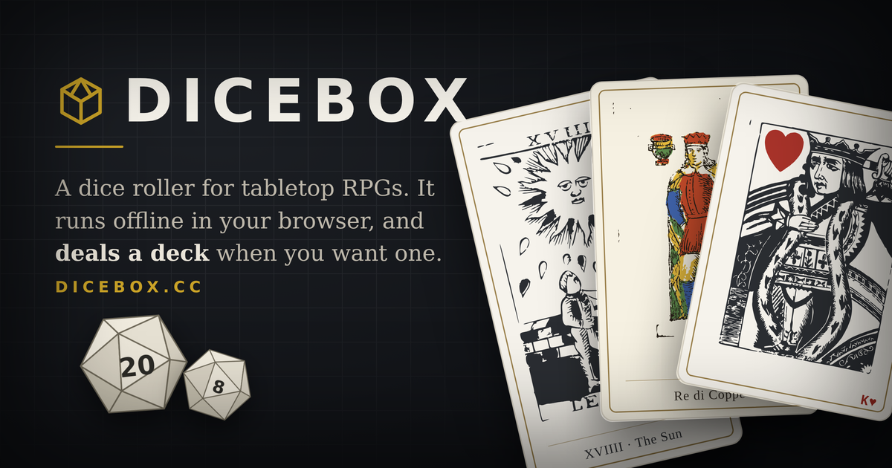
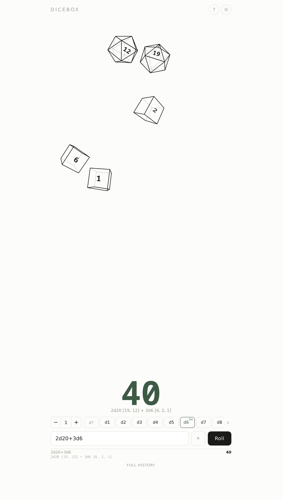
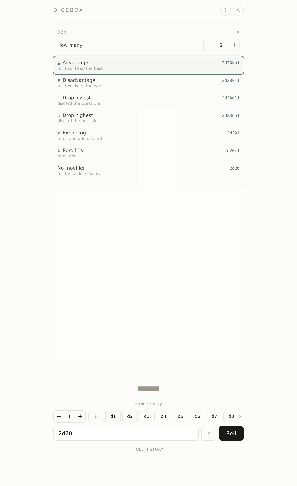
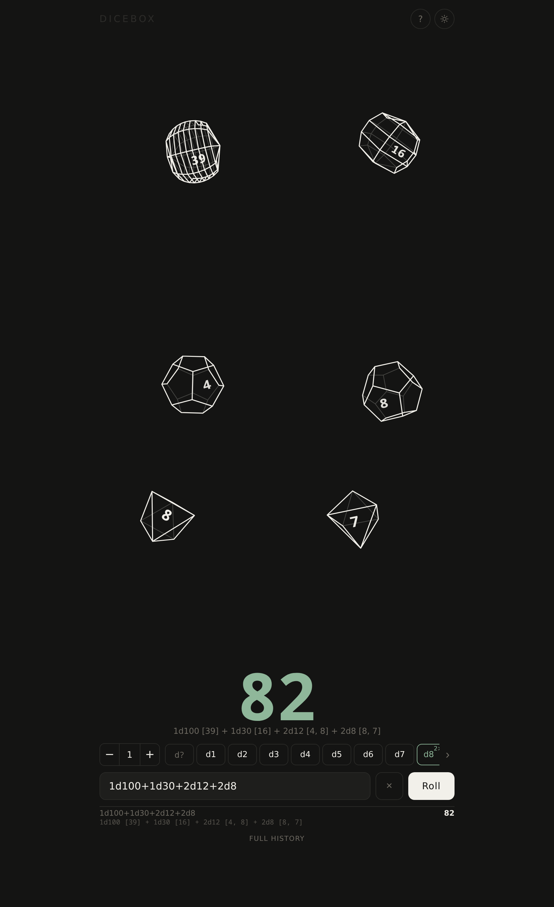
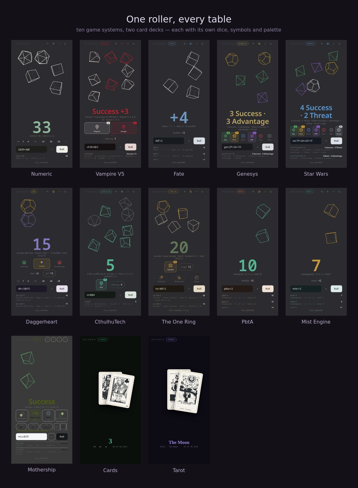
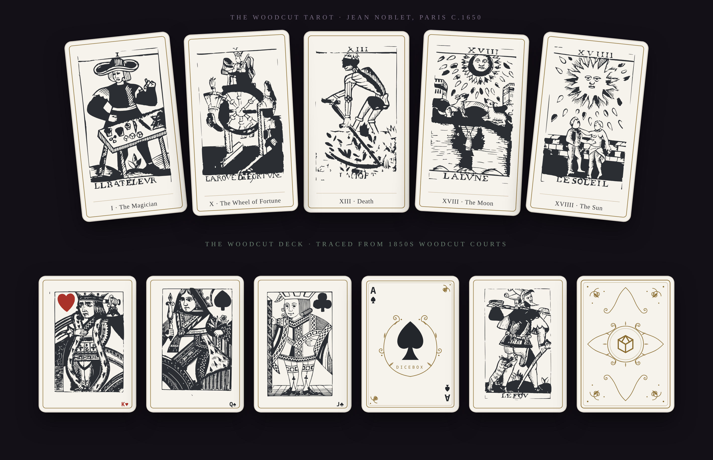

# Dicebox

<p align="center">
  
</p>

A tactile dice roller and card drawer that works on phones, tablets, and desktops.

**[Use Dicebox at dicebox.cc](https://dicebox.cc).** This is the primary hosted
Dicebox service, not a temporary demo. It is free to use, needs no account, and
is meant to be there when you need it.

Dicebox is also open source and self-hostable. Install it as a PWA, download the
whole app as a single HTML file, or run a copy on your own server. Those are not
lesser versions: they are part of the point, and they keep working offline.

I built Dicebox because I could not find the thing I wanted: a simple, tactile
dice roller that looked good, felt good to use, worked on whatever device was
nearby, and did not turn every throw into someone else's data. It grew from
there.

With Dicebox you can:

- put up to 500 dice in each notation term, using anything from d1 to d1000 in
  the picker (typed notation accepts sides up to d10000);
- build rolls by tapping or typing standard notation, with advantage,
  disadvantage, keep/drop, exploding dice, and rerolls;
- switch among **19 built-in game modes**, each with its own controls, dice,
  result reading, colours, and short URL;
- draw from **five card decks**, including the Woodcut playing cards and tarot,
  carte napoletane, Hanafuda, and Uta-garuta;
- share live rolls through an end-to-end encrypted Dicebox room; or
- install the [hosted Owlbear Rodeo extension](#in-owlbear-rodeo) from
  `vtt.dicebox.cc` and share automatically with the current Owlbear game.

The standalone app keeps rolls and history on your device unless you join a
shared room. Inside the Owlbear extension, game broadcasting and listening are
part of the VTT mode and remain enabled while its action popover is closed. They
use Owlbear's readable room broadcast rather than Dicebox's end-to-end
encryption. [The sharing section](#rooms) explains both trust boundaries.

<p align="center">
  
  &nbsp;
  
  &nbsp;
  
</p>

<p align="center">
  <em>Tap dice to build a pool · hold one for modifiers · light and dark</em>
</p>

## About

Dicebox started as a personal project. I kept running into the same problem:
there was no clean, open source, offline-capable dice app that felt as good to
use as the physical thing. I built the version I wanted, then kept adding the
games and decks my friends and I cared about. It is still a personal project,
but `dicebox.cc` is a real hosted service and I want people to use it.

It was made with Claude Code. If that is not your bag, that is completely fine:
the source is here, the license is permissive, and you can inspect it, fork it,
or run it without depending on me. Questions, bug reports, pull requests and
forks are welcome.

MIT licensed.

## Using it

Tap dice to build a pool: tap `d20` twice and `d6` once and you have `2d20+1d6`,
staged on the tray and written into the notation field. Press **Roll**, or flick
the tray, to throw them. The pool survives the roll, so re-rolling the same
handful is one more tap.

Typing notation by hand works the same way — the field is the source of truth,
and tapping a die extends whatever is already there.

The number on the left is how many dice each tap adds, so `100` then `d6` gives
you `100d6` without a hundred taps.

**Hold a die** for advantage, disadvantage, drop high/low, exploding and reroll.
Modifiers that answer different questions stack — `4d6dl1!` drops the lowest and
explodes — while two that answer the same one replace each other.

The `d?` button opens a picker for any side count from 1 to 1000, and a die you
choose there gets a button of its own.

## Notation

| Input | Meaning |
| --- | --- |
| `3d6` | three six-sided dice |
| `d20` | one d20 (count defaults to 1) |
| `1d20+5` | with a modifier |
| `2d6+1d8-1` | any number of terms |
| `d%` | percentile, same as `d100` |
| `4d6kh3` | keep highest 3 (ability scores) |
| `2d20kl1` | keep lowest 1 (disadvantage) |
| `4d6dl1` | drop lowest 1 |
| `1d6!` | exploding — reroll and add on a max face |
| `1d10r2` | reroll any result of 2 or lower |

Sides are arbitrary from 1 to 10000, so Mothership's `d100`, DCC's `d14`/`d24`,
and anything else all work. Dropped dice stay visible in parentheses rather than
disappearing.

## Game systems

Plenty of games do not roll a plain sum. Dicebox has a mode for a number of
them, each with its own dice, symbols and reading of the result. Pick one from
the switcher in the top bar — the icon beside the wordmark — and the tray, the
picker and the notation all change to match.

<p align="center">
  
</p>

| System | Notation | What it rolls |
| --- | --- | --- |
| **Alien RPG** | `yz:5b1x` | a Year Zero d6 pool with Stress, Panic and push |
| **Blade Runner RPG** | `br:12,8` | Attribute and Skill step dice, advantage/disadvantage and push |
| **Call of Cthulhu 7e** | `coc:65b` | d100 roll-under with bonus and penalty dice |
| **CthulhuTech 2e** | `ct:8@4` | a d10 pool counting even-face hits |
| **Dungeon Crawl Classics** | `d16` | the complete dice chain, with an active die that steps up and down |
| **Delta Green** | `dg:50` | d100 roll-under, criticals on matching digits |
| **Daggerheart** | `dh:+2@15` | the Hope and Fear duality dice |
| **Fate / Fudge** | `4dF+2` | four +/blank/− dice and the ladder |
| **Genesys** | `gen:2A+1P+2D` | narrative dice with symbol cancellation |
| **Ironsworn** | `iron:+2` | action and progress rolls, plus the Ironsworn/Delve oracle library |
| **Mist Engine** | `mist:+1` | 2d6 + Power for City of Mist and Legend in the Mist |
| **Mothership 1e** | `ms:c@35` | d100 roll-under, Panic and tracked Stress |
| **Powered by the Apocalypse** | `pbta:+1` | 2d6 + stat with the 10+ / 7–9 / 6− ladder |
| **Starforged** | `iron:+2` | action and progress rolls, plus Starforged oracle tables |
| **Star Wars RPG** | `sw:2A+2D+1F` | narrative dice with the Force die |
| **Twilight: 2000 4e** | `t2k:12,8,3` | Attribute and Skill step dice with ammo dice and push |
| **The One Ring 2e** | `tor:3@14` | the Feat die and a pool of Success dice |
| **Vampire: The Masquerade V5** | `v5:8h3` | a d10 pool with Hunger, successes and messy criticals |
| **Year Zero Engine** | `yz:5b3s2g` | Base, Skill and Gear d6 pools with push mechanics |

Each mode has a picker built for its own dice — tap to build the pool, hold to
adjust — and a help panel (the **?** in the top bar) with its full rules and
notation. Symbols are drawn the way the official dice show them, and the plain
numbers they landed on are always in the line under the result. Ordinary dice
still roll in any mode, so weapon damage or a stray d20 needs no mode change.

Every mode has its own short URL — `dicebox.cc/dh`,
`/mosh1e`, `/vtmv5` and so on — which opens Dicebox straight into it.

## Card decks

Five of the modes deal cards instead of dice. The deck sits on the tray like a
dealer's shoe: tap it to draw, and the cards deal, flip and settle the way the
dice tumble. Draws come off a real shuffled order and the deck remembers what is
gone until you shuffle. The cards are physical things: tap a drawn card to pick
it up for a closer look, flick it to send it to the discard pile without
drawing, and tap the discard pile to page back through everything in it.

<p align="center">
  
</p>

**Cards** is a 52-card French-suited deck, jokers optional. **Tarot** is the
full 78-card Tarot de Marseille, with reversals and a majors-only option.
**Napoletane** is the 40-card Italian deck of Scopa and Briscola, in full
stencil colour from a deck printed in Naples in 1902 — a mode that speaks
Italian, from the picker to the help panel. **Hanafuda** is the 48-card
Japanese flower deck of Koi-Koi, in Louie Mantia, Jr. and すけじょ's
traditional-colour set (CC BY-SA 4.0, via Wikimedia Commons) — the one deck
in the box drawn by other hands. Everything the pickers do is typeable too —
`deck:3 jokers replace`, `tarot:3 majors upright`, `nap:3`, `hana:8` — so the
notation still describes the whole draw. **Uta-garuta** is the 100
yomifuda of the Ogura Hyakunin Isshu — draw a single card (`uta:1`) and the
whole poem reads out under the result, with Clay MacCauley's public-domain
translation; the help panel carries the Bōzu Mekuri rules, and the portraits
and calligraphy are traced from Hishikawa Moronobu's illustrated edition
(Edo, 1680), digitised by the Library of Congress.

The woodcut art is not clip-art. Those decks are traced by hand from
public-domain woodcut cards held by the Bibliothèque nationale de France —
as single-colour vector line that retints cleanly for light and dark, and in
full stencil colour with each deck's own palette measured from the scans.
They are released as their own CC0 repositories, usable well outside Dicebox:

- **[woodcut-cards](https://github.com/SONDLecT/woodcut-cards)** — the 52-card
  deck, two jokers and the back
- **[woodcut-tarot](https://github.com/SONDLecT/woodcut-tarot)** — all 78 cards
  of the tarot
- **[woodcut-napoletane](https://github.com/SONDLecT/woodcut-napoletane)** —
  the 40 carte napoletane, keyline and colour
- **[woodcut-utagaruta](https://github.com/SONDLecT/woodcut-utagaruta)** —
  the 100 yomifuda of the Hyakunin Isshu, with the poems as data

## How the rolls work

Every die is decided by `crypto.getRandomValues`, the browser's cryptographic
random source. `Math.random()` is not used anywhere in the roll path — it is a
fast pseudo-random generator, seeded per page and predictable given enough
output, which is fine for animation and wrong for the numbers.

Turning random bytes into a die takes some care. Asking for a 32-bit number and
taking `% 20` is the obvious approach and it is subtly unfair: 2³² does not
divide evenly by 20, so the first few faces come up very slightly more often.
Instead a value is drawn and **rejected** if it falls in the remainder at the
top of the range, then drawn again. Every face ends up equally likely, and the
loop almost always finishes on the first try.

### The animation is a picture, not a physics engine

The number is decided the instant you roll — before anything moves. What follows
is a drawing of that outcome, not a simulation that produces it.

The dice do tumble, bounce off the walls of the tray, push each other apart and
settle showing a face, but none of it feeds back into the result. A die that
lands showing 17 was already a 17. This is deliberate: a real physics simulation
would make the outcome depend on frame timing, floating-point rounding and how
hard you flicked, none of which are fair or reproducible. Watching the dice
should be enjoyable; it should not be what decides the roll.

The same goes for the tidying afterwards — dice drift into a sorted grid, group
by type and order high to low. That is presentation.

### Why a d1000 really does have a thousand faces

Dicebox used to stop detailed geometry at 120 facets. It no longer does. From
d4 through d1000, every die has one legal outcome face for each side. In almost
every case the raw solid also contains exactly that many polygonal faces: a d17
has seventeen, a d100 has a hundred and a d1000 has a thousand.

The d5 and d7 are deliberate visual exceptions, not approximations. The d5 has
five legal landing faces plus bevel polygons; the d7 has seven landing faces
cut into a smooth shell. Those extra polygons shape the die but never create
extra results.

The d1, d2 and d3 have to work differently because a closed solid cannot
literally have one, two or three faces. The d1 is an obliquely cut cylinder whose
two landing caps both read 1. The d2 is a coin with two outcome faces and a
modelled rim. The d3 is a cube with its three outcomes repeated on opposite face
pairs.

At high counts the challenge is displaying the geometry, not generating it.
For d101 and above, Dicebox keeps the die's final tumble pose, draws its
silhouette more strongly than its interior edges and places the result over the
centre. That keeps an exact d1000 legible and smooth on a phone without quietly
replacing it with a lower-faced solid. Typed dice above d1000 still roll normally
(up to d10000), but their visual body is capped at 1000 faces.

Low-sided dice use recognisable dedicated solids while high-sided dice spread
their facets evenly over a rounded form. The shape family changes so the die
survives being small; the facet count stays honest through d1000.

## Rooms

A room shares your rolls with other people in real time. Everyone sees the same
log; each screen animates its own dice from the result. It is for playing at a
distance with people you already know.

Rooms are **opt-in and off by default**. Dicebox is a local dice roller first
and stays one — if you never open the Share panel, nothing about the app talks
to a network, and none of what follows applies to you.

You join by passphrase. The app generates a short phrase of ordinary words;
whoever has it is in the room, and that is the whole membership model. Share it
however you already talk to each other. The passphrase is what derives the
encryption key, so it never travels over the network — the relay never receives
it, is never sent it during a join, and has no way to ask for it.

In a Dicebox passphrase room, the roll itself never waits on the network. If the
Dicebox relay is unreachable your dice still land instantly; the app tells you
it cannot share and carries on. No spinner, no queue, no waiting. A roll that
arrives ten minutes late is worse than one that never arrives, so late rolls are
dropped rather than held.

Rooms are ephemeral. Nothing is stored, so someone joining halfway through sees
rolls from that moment on and no earlier. A room dies after 30 minutes idle, and
in any case 12 hours after it was created — a departed player keeps the
passphrase forever, so expiry is the only thing here that resembles taking
access away.

### How it fits together

Three pieces, and the boundaries between them are the point:

```
  your browser                    a relay                  other browsers
  ────────────                    ───────                  ──────────────
  passphrase ──► key                                          key ◄── passphrase
       │                                                             │
       ▼                                                             ▼
  roll ─► encrypt ─────────► ciphertext, fanned out ─────────► decrypt ─► roll
                             (never holds a key,
                              never stores a byte)
```

- **The app** is static files. Any web server will do, and it needs no backend
  at all unless you want rooms.
- **The relay** is a separate service on a **separate origin**, which is what
  makes the guarantee checkable rather than a promise: a different party serves
  the code than carries the messages.
- **The passphrase never leaves the browser.** It derives a room id the relay
  sees and a key the relay never does, through PBKDF2 and HKDF with different
  info strings, so learning one tells you nothing about the other.

The app finds its relay through one meta tag in `index.html`, and the browser
is only allowed to reach that exact origin because the `connect-src` in your
headers names it. Both have to agree or the socket is refused — which is
deliberate, and covered under [Running your own relay](#running-your-own-relay).

Nothing above applies until someone opens the Share panel. With no relay
configured the app is a local dice roller and the room code never runs.

### Running your own relay

The relay is a small WebSocket server that forwards encrypted messages between
people in the same room. It is a fanout and nothing else: it cannot read a roll,
it never decides one, and it writes nothing to disk.

There are two implementations of it, speaking the same protocol. **Start with
the Node one** — it runs anywhere, and you can read the whole thing:

```sh
node server/relay.mjs                    # 127.0.0.1:8787
docker compose --profile rooms up -d     # or as a container
```

The `rooms` profile means the relay only starts when you ask for it — plain
`docker compose up -d` brings up the static app exactly as before.

The second is a Cloudflare Worker backed by Durable Objects, which is what the
hosted service runs. It exists for one reason: a dice room is idle between
rolls, and the hibernation API lets an idle room evict from memory while its
sockets stay open.
If you are not paying per-request for a public instance, you do not need it.

```sh
node tools/deploy-relay.mjs              # needs .env, see .env.example
```

[`server/README.md`](server/README.md) covers both, what differs between them, and why.

It binds loopback by default, so a fresh install is not reachable from the
network until you decide it should be. Put it behind whatever TLS terminator you
already run, then point the app at it by changing the relay origin in
`docker/security-headers.conf` (self-hosted) or `worker.js` (Cloudflare).

One thing to set while you are there: **turn off access logging on whatever
terminates TLS in front of the relay.** The room id travels in the request URL,
so nginx and Caddy both write it to disk by default — the full id, not the
eight-character prefix the relay itself logs, and it stays there long after the
room has expired. [`server/README.md`](server/README.md) has the configuration.

That origin is **pinned to one exact host** rather than opened up to `wss:` or
`*`. This limits a compromised build to the origins already allowed by the
policy instead of letting it connect to an arbitrary third-party host. It is not
a defence against a compromised Dicebox origin or relay: both `self` and the
configured relay are permitted destinations. Widening the policy to make a
setup problem go away gives up the narrower protection it does provide.

[`server/README.md`](server/README.md) covers the configuration — limits,
timeouts, origins — in full.

### In Owlbear Rodeo

Dicebox is available as an [Owlbear Rodeo](https://www.owlbear.rodeo/)
extension. It is the same roller in a compact action panel, with one additional
sharing path: every running Dicebox panel in the same Owlbear game can exchange
finished rolls over Owlbear's own [Broadcast API](https://docs.owlbear.rodeo/extensions/apis/broadcast/).
The Owlbear game is the room, so there is no Dicebox passphrase to exchange.

#### Install the hosted extension

1. In Owlbear Rodeo, open **Profile → Add Extension**.
2. Paste this manifest URL:

   ```text
   https://vtt.dicebox.cc/manifest.json
   ```

3. Create a room, or edit an existing room, and enable **Dicebox** in its
   extensions list.
4. Open the room and click the Dicebox action in the top-left toolbar.

This follows Owlbear's normal [extension installation flow](https://docs.owlbear.rodeo/extensions/tutorial-hello-world/install-your-extension/).
The hosted manifest and panel are public static files; no Dicebox account is
required.

#### Sharing at the Owlbear table

Enabling Dicebox in an Owlbear game enables Owlbear sharing and listening. There
is no separate opt-in or opt-out switch: this is the VTT extension, and table
interoperability is part of that mode. The Share rolls menu shows only a compact
**Owlbear mode · Rolls are shared with this game** note.

Dicebox declares a manifest `background_url`. That background page starts when
Owlbear enables the extension, waits for its own `OBR.onReady()`, and remains the
transport and state coordinator while the Dicebox action popover is closed. It
receives completed table rolls, retains bounded room-local history, and can
answer requests from other extensions running on the same local Owlbear client.
Opening the action later hydrates its history and current tracked state; it does
not reroll those authoritative results.

History is local to this browser and Owlbear room, not server or cross-device
synchronisation. The primary cache is IndexedDB, bounded to 500 records and 2
MiB; a guarded local-storage cache is used only when IndexedDB is unavailable.
History replies are paged below Dicebox's 12 KiB wire ceiling because Owlbear
Broadcast has a hard 16 KiB message limit.

#### Owlbear sharing versus Dicebox rooms

These are separate transports with deliberately different trust boundaries:

| | Owlbear game broadcast | Dicebox passphrase room |
| --- | --- | --- |
| Membership | The current Owlbear game | Anyone with the passphrase |
| Activation | Always active when the extension is enabled | Off until someone creates or joins a room |
| Transport | Owlbear's extension Broadcast API | A Dicebox WebSocket relay |
| End-to-end encrypted by Dicebox | **No** | **Yes** |
| Useful outside Owlbear | No | Yes — browser tabs, phones, another table |
| Stored backlog | Bounded, local room cache | None |

Owlbear-broadcast payloads contain the roll in readable form. Owlbear carries
that message, and another extension that deliberately listens on Dicebox's
known channel can read it. The passphrase room instead encrypts the roll in the
sender's browser before Dicebox's relay sees it; the relay receives ciphertext
and never receives the key or passphrase.

Both transports can be active at once. Dicebox stamps one id on a locally
completed roll before publishing it, deduplicates arrivals, and never forwards
an incoming Owlbear event into the passphrase room or an incoming encrypted-room
roll into Owlbear. There is no relay amplification loop.

Neither transport proves that a roll came from an unmodified client. Incoming
data is checked for a valid, bounded Dicebox shape. Owlbear connection metadata
limits request execution to this player's local connection, but it is not a
cryptographic identity and does not reveal which local extension sent a
request.

#### For extension developers: versioned broadcast contract

Every Owlbear iframe is a separate SDK context. Wait for `OBR.onReady()` in your
own context, then use the single channel:

```text
cc.dicebox.rolls
```

Protocol messages carry `v: 1` and a typed `type`. Requests and their correlated
responses are local RPC:

```js
await OBR.broadcast.sendMessage('cc.dicebox.rolls', {
  v: 1,
  type: 'roll.request',
  requestId: 'forms-123',
  notation: 'yz:5b3s2g'
}, { destination: 'LOCAL' });
```

A stateful follow-up references a Dicebox-owned authoritative roll id:

```js
await OBR.broadcast.sendMessage('cc.dicebox.rolls', {
  v: 1,
  type: 'action.request',
  requestId: 'forms-124',
  action: 'push',
  rollId: 'dicebox-roll-789'
}, { destination: 'LOCAL' });
```

| Type | Purpose | Correlated response |
| --- | --- | --- |
| `roll.request` | Numeric notation, all built-in systems, five deck modes, Rouse checks, and Ironsworn/Starforged oracles | `roll.result` or `roll.error` |
| `action.request` | `push` by authoritative `rollId`, or Dicebox-owned deck `shuffle`/`reset` | `roll.result`, `action.result`, or `roll.error` |
| `history.request` | Ask the local background for retained room history | One or more paged `history.result` messages |

`requestId` is 1–96 characters and is echoed only in local responses. Dicebox
owns RNG, interpretation, Hunger, Stress, decks, oracle lookup, push eligibility,
history, timestamps, roll ids, and player attribution. Callers provide intent,
not precomputed outcomes. Stateful requests are serialised through a bounded
queue, deduplicated, rate-limited, and time out explicitly. Reusing one
`requestId` for different work fails with `request_id_conflict`.

Completed table events are published with explicit `destination: 'REMOTE'` as
`roll.event`. Pushes use `roll.transition` with `parentId` and exact `held`,
`rerolled`, and `added` indexes so receiving Dicebox panels preserve held dice
and animate only changed or new dice. Incoming events are displayed and archived
but never republished. Legacy untyped completed-roll payloads remain readable
during the v1 migration.

Owlbear Broadcast messages must be JSON-serialisable and cannot exceed 16 KiB.
Dicebox uses a 12 KiB application ceiling for envelope headroom. Oversized
requests/results receive correlated `request_too_large` or `result_too_large`
errors rather than disappearing. History is split into bounded pages. The public
bridge caps numeric requests at 100 dice across 64 terms, while the standalone
notation engine still permits up to 500 dice per term. Completed-event retention
also admits at most 100 new Broadcast events per ten seconds before persistence.

`sendMessage()` resolving means Owlbear accepted the SDK command; it is not a
receiver acknowledgement. Use the correlated result/error message as the
application-level answer. Broadcast is ephemeral, so do not expect Owlbear to
replay anything you missed; Dicebox's retained history is its own bounded local
cache.

The implementation lives in [`owlbear-session.js`](owlbear-session.js),
[`owlbear-history.js`](owlbear-history.js), and the Owlbear-only background entry
point under [`owlbear/`](owlbear/). Those assets are copied only into the VTT
artifact. Ordinary `dicebox.cc`, the PWA, offline bundles, and standalone
self-hosted builds do not initialize the bridge.

#### Host your own panel

```sh
npm run build:owlbear -- --relay=wss://relay.example.com/ws --host=vtt.example.com
npm run deploy:owlbear
```

The relay argument serves the optional encrypted passphrase-room feature; the
Owlbear game broadcast itself uses Owlbear's SDK. The panel must have its **own
origin**, not a path on the main app's origin: its CSP permits Owlbear to frame
it while the main app refuses all framing, and the main app's root-scoped
service worker must never claim the panel. The build and deploy scripts enforce
that separation.

[`owlbear/README.md`](owlbear/README.md) covers self-hosting, relay allowlists,
CSP/CORS headers, SDK vendoring, deployment, and troubleshooting in depth.

### What passphrase-room privacy actually is

In a Dicebox passphrase room, rolls are encrypted in your browser and decrypted
in the other players' browsers. The Dicebox relay only ever sees ciphertext.
Names, notation, dice values and totals are all inside it. This section does not
apply to the Owlbear game broadcast described above.

**Self-hosting, or the downloaded single file, gives a real "we cannot see your
rolls" guarantee.** You are running the code, and you can read it.

**The hosted service has a different trust boundary, and this is a genuine
difference rather than a technicality.** [dicebox.cc](https://dicebox.cc) serves
the JavaScript that does the encrypting. Encryption in the browser is only as
trustworthy as the code the browser was handed, so using the hosted app means
trusting me to keep serving honest code — not just today but on every load, since
the app updates itself. I have no plans to do otherwise, but a promise is not a
guarantee, and you should not accept one where you can have the real thing. If
that distinction matters for your table, self-host or use the single file. Both
are a few minutes of work and are why they exist.

Two more limits worth being straight about, and neither is fixable by
encryption:

**A relay sees traffic shape.** It cannot read content, but it knows a room
exists, how many connections are in it, when they arrive and leave, and roughly
how much they send. Who was playing and when is visible to whoever runs the
relay, even though what you rolled is not. Running your own is the answer if
that matters.

**Rolls are generated on each player's own device.** The app rolls honestly with
`crypto.getRandomValues` and reports the result, but a modified client could
report anything, and no amount of cryptography can tell an encrypted lie from an
encrypted truth. The app does check incoming rolls for internal consistency —
that the dice add up to the total — which catches a broken client and would not
catch a determined one. There are deliberately no "verified roll" badges,
because they would suggest a guarantee that does not exist. Rooms are for
friends. If you need dice nobody at the table could have tampered with, you need
someone else holding them.

## The roll log

Every roll is kept for the session, with what each die landed on and when.
**Full history** under the recent rolls opens the lot, and exports it:

- **Copy** puts a readable log on the clipboard
- **CSV** gives one row per die — time, notation, total, sides, value, and
  whether it was kept, exploded or rerolled — which is the shape you want for
  counting faces or checking whether a die is drifting
- **JSON** is the same data with the structure intact

The stored log itself stays in the browser unless you export it. When sharing is
active, the newly completed roll is also sent through the selected transport as
described in [Rooms](#rooms) and [In Owlbear Rodeo](#in-owlbear-rodeo); opening or
exporting the full log does not upload its earlier entries.

## Getting it offline

Three ways, easiest first.

### Download one file

Grab **[dicebox.html](https://dicebox.cc/dicebox.html)** — or the copy
in [`dist/`](dist/dicebox.html) — and open it. That is the entire app in a single
file: no server, no install, no network. Put it on a USB stick, email it to
yourself, keep it in a folder with your character sheets. It works the same on a
laptop with the wifi off.

The help panel inside the app links to it too.

### Install it from the web

Open [Dicebox](https://dicebox.cc) and install it. After the first
load it runs offline, because a service worker keeps a local copy.

| Browser | How |
| --- | --- |
| Chrome, Edge (desktop) | Install icon in the address bar, or ⋮ → Cast, save and share → Install page as app |
| Chrome (Android) | The **Install as an app** button in the help panel, or ⋮ → Add to Home screen |
| Safari (iOS/iPadOS) | Share → Add to Home Screen |
| Safari (macOS) | File → Add to Dock |
| Firefox | No install support on desktop. Bookmark it — it still works offline once loaded — or use the single-file build above |

### Run your own copy

There is no build step and no backend, so anything that serves a directory over
HTTP will do. It needs `http://` rather than `file://` only so the service worker
can register; the single-file build has no such requirement.

```sh
python3 -m http.server 8080     # or: npx serve, php -S localhost:8080, caddy file-server
```

### Docker

If you would rather run it as a container:

```sh
docker compose up -d            # http://localhost:8080
```

The image is nginx with the app copied in — nothing is compiled and nothing is
fetched at runtime. The bundled nginx config applies the same security and cache
headers the hosted copy uses. To serve on a different port, change the mapping in
`docker-compose.yml`.

For a home network, put it behind whatever reverse proxy you already run. It
needs HTTPS only if you want to install it to a phone's home screen; browsers
require a secure context for that, with `localhost` exempt.

## Working on it

```sh
npm test          # every suite, including the single-file bundle and the panel
npm run bundle    # rebuild dist/dicebox.html on its own
npm run build:owlbear -- --relay=wss://...   # the Owlbear panel
```

### Deploying

Everything goes to Cloudflare Workers, and every script reads `.env` — see
`.env.example` for what has to be in it.

```sh
npm run deploy:dev        # dev.dicebox.trollskull.cc
npm run deploy            # the live site
node tools/deploy-relay.mjs [--dev]   # the relay
npm run deploy:owlbear    # the Owlbear panel, after build:owlbear
```

Each is a separate script rather than one with flags, because they have almost
nothing in common: the app is static assets fronted by a header-setting Worker,
the relay is a script with a Durable Object namespace and no assets, and the
panel is a generated directory on an origin of its own.

Three things are handled for you, and all three used to be documented
instructions that someone had to remember:

- **The service worker's cache name** is derived from a hash of everything
  shipped beside it. A stale cache name is the worst bug this project has,
  because it has no symptom at the origin: every file is correct and installed
  copies keep serving the previous build regardless.
- **The build id** shown in the help panel is the same hash, so a copy that
  says which build it is cannot be wrong about it.
- **The relay origin** is substituted into `index.html` at deploy time from
  `RELAY_URL`, so staging and production can point at different relays without
  the two ever differing in the repository.

The single-file build in `dist/` is committed, so rebuild it with `npm run
bundle` when you change anything it inlines. `npm test` does it anyway.
